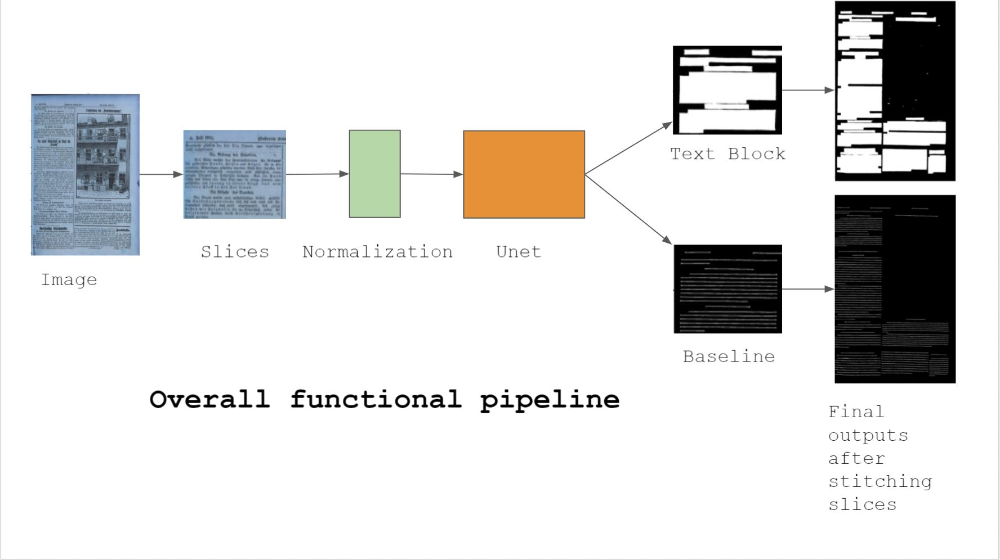
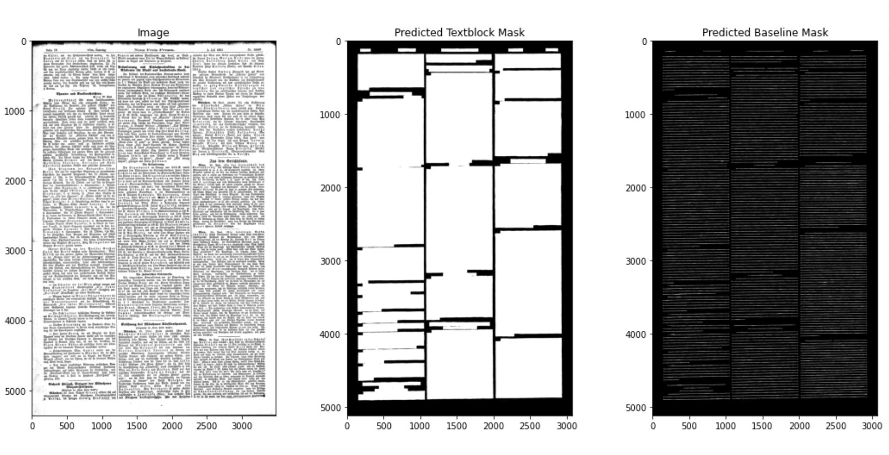

# Multi Task Text Block and Baseline Segmentation

## Team Members
<ul>
  <li><a href="https://github.com/divyanshjoshi">Divyansh Joshi</a></li>
  <li><a href="https://github.com/devash76">Devashish Tripathi</a></li>
  <li><a href="https://github.com/arunps007">Arun Pratap Singh</a></li>
  <li><a href="https://github.com/mprerana">Prerana Mukherjee</a></li>
  <li><a href="#">Anukriti Bansal</a></li>
</ul>

## Introduction
  Tensorflow code for the paper Multi-task Learning for Newspaper Image Segmentation and Baseline Detection Using Attention-Based U-Net Architecture. This repo contains the code to the multi task attention U-Net that we used for basline segmentation and textblock segmentation. The apart from the model, **main.ipynb** file contains the code for pre-processing,
  visualising attention maps and testing.
  </br>
  
## Model Pipeline
  
  <br>
   
  <br>
  
## Installation 
1.Clone the repo
  ```
  git clone https://github.com/divyanshjoshi/Attention-U-Net-Newspaper-Text-Block-Segmentation.git
  ```
2.Install requirements.txt file
  ```
  pip install -r requirements.txt
  ```
3.Run the main.ipynb file

4.Done!
  
 ## Results
  Results after training the model 
  
  
  
  
 ### Sample Dataset will be available after the paper has been indexed
