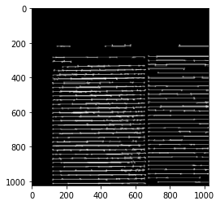
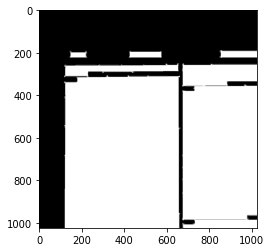

# Text-Block-Segmentation
Segmenting text blocks from newspaper images using deep learning techinques

## Team Members
<ul>
  <li><a href="https://github.com/divyanshjoshi">Divyansh Joshi</a></li>
  <li><a href="https://github.com/devash76">Devashish Tripathi</a></li>
  <li><a href="https://github.com/arunps007">Arun Pratap Singh</a></li>
  <li><a href="https://github.com/mprerana">Prerana Mukherjee</a></li>
  <li><a href="#">Anukriti Bansal</a></li>
</ul>

## Introduction
  Tensorflow code for the paper Multi-task Learning for Newspaper Image Segmentation and Baseline Detection Using Attention-Based U-Net Architecture. This repo contains the code to the multi task attention U-Net that we used for basline segmentation and textblock segmentation. The apart from the model, main.ipynb file contains the code for pre-processing,
  visualising attention maps and testing.
  </br>
  
## Model Pipeline
  
  <br>
   
  <br>
  
## Installation 
1.Clone the repo
  ```
  git clone https://github.com/divyanshjoshi/Attention-U-Net-Newspaper-Text-Block-Segmentation.git
  ```
2.Install requirements.txt file
  ```
  pip install -r requirements.txt
  ```
3.Run the Multi-Task_Attention_U-Net_Slices.ipynb file
<br>
4.You're all set!


<br>

  <li><h2>Text Block Segmentation Notebook</h2></li>
  <ul>
  <p> This Notebook is mainly divided into four parts : Data Preprocssing, Multi-Task Attention U-Net, Visualizing Attention Maps, Testing. A brief description of each section is given below. </p><br>
  
  <li><h4> Data Preprocessing: </h4> </li>
  1. All the images of the dataset are cut into slices of size 1024 x 1024.<br>
  2. Data generator to process images in the U-Net <br>
    &emsp; input: dataset CSV file, paths to images/masks, train_length, shape of image<br>
   &emsp;  output : X_train, Y1_train(Textblock), Y2_train(Baseline) numpy arrays of shape (train_length, height, width, _)<br>
    
     <br>
  <li> <h4> Multi-Task Attenion U-net: </h4> </li>
  <p>
    The multitask attention U-net for Basline detection and Text Block Segmentation<br>
    input : img_shape (1024, 1024, 3) i.e, slice <br>
    output: U-Net<br>
  </p>
  <li> <h4> Visualizing Attention maps: </h4> </li>
  <p>
  1.Produces attention maps for every attention block in the U-Net <br>
     &emsp; input: model, image <br>
    &emsp;  output: plot of attention maps for the U-Net <br>
    </p>
   <li> <h4> Testing: </h4> </li>
  <p> 
  1. Loads the test dataset. <br>
  2. Loading the best saved weights for model testing.<br>
  3. Generates predicted baseline and texblock mask for the given image slice.<br>
  4. Evaluating the defined matrices. <br>
  </p>
  </ul>
  
  
