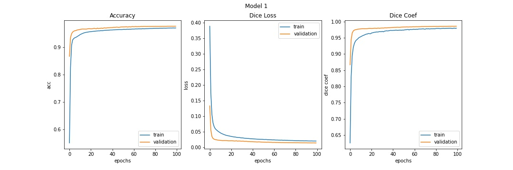
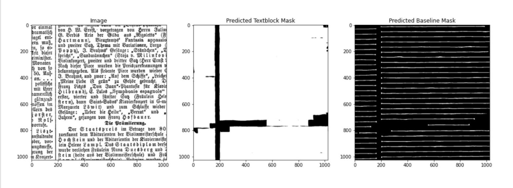

# Text-Block-Segmentation
Segmenting text blocks from newspaper images using deep learning techinques

<ul>
  <li> <h2> Introduction </h2> </li>
  Tensorflow code for the paper Multi-task Learning for Newspaper Image Segmentation and Baseline Detection Using Attention-Based U-Net Architecture. This repo contains the code to the multi task attention U-Net that we used for basline segmentation and textblock segmentation. The apart from the model, main.ipynb file contains the code for pre-processing,
  visualising attention maps and testing.
  </br>
  
## Model Pipeline
  
  <br>
   
  <br>
  <li><h2> Installation </h2> </li>
  <br>
  <h3> Clone the Repository: </h3><br>
  
```
git clone https://github.com/divyanshjoshi/Attention-U-Net-Newspaper-Text-Block-Segmentation.git
```

<br>

  <li><h2>Text Block Segmentation Notebook</h2></li>
  <ul>
  <p> This Notebook is mainly divided into four parts : Data Proeprocssing, Multi-Task Attention U-Net, Visualizing Attention Maps, Testing. A brief description of each section is given below. </p><br>
  
  <li><h4> Data Preprocessing: </h4> </li>
  1. All the images of the dataset are cut into slices of size 1024 x 1024.<br>
  2. Data generator to process in the U-Net <br>
     input: dataset CSV file, paths to images/masks, train_length, shape of image<br>
     output : X_train, Y1_train(Textblock), Y2_train(Baseline) numpy arrays of shape (train_length, height, width, _)<br>
     
     
  3. 
  </ul>
  
  
## Photo for model 
<br>
 
 <br><br>
 
 <br><br>
 
 <br><br>
</ul>
